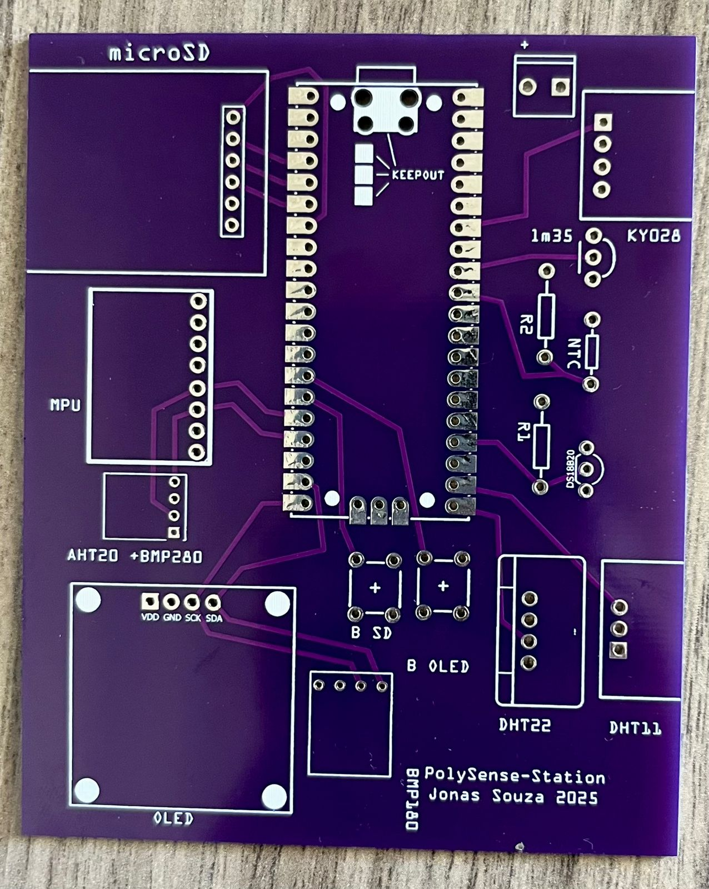
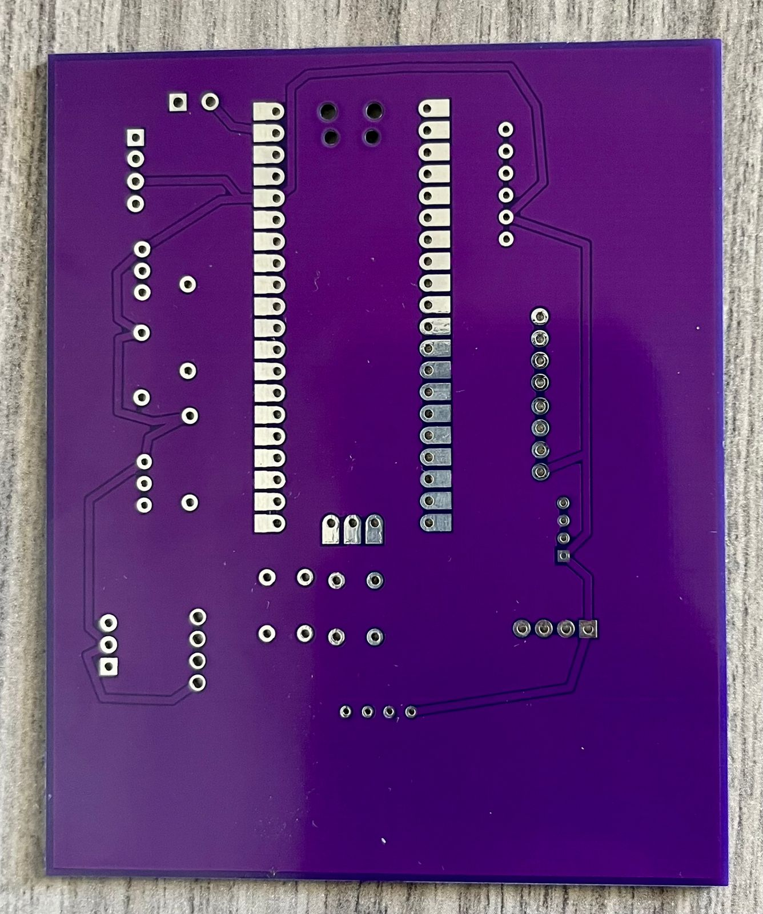
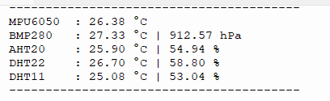

# PolySense Station - PCB

Custom PCB design for the PolySense Station environmental monitoring system.

## Overview

This PCB was designed to integrate all sensors, the Raspberry Pi Pico microcontroller, SD card module, OLED display, and RTC into a single compact board. The design simplifies assembly, improves reliability, and reduces the physical footprint compared to the original protoboard implementation.

## Manufacturing

- **Manufacturer**: [JLCPCB](https://jlcpcb.com/)
- **PCB Specifications**:
  - Layers: 2
  - Thickness: 1.6mm
  - Surface Finish: HASL (Lead-Free)
  - Copper Weight: 1 oz
  - Solder Mask Color: Purple
  - Silkscreen: White

## Directory Structure

```
PCB/
├── Photos/                    # PCB photos and test results
│   ├── PCB_front.jpg         # Front view of manufactured PCB
│   ├── PCB_back.jpg          # Back view of manufactured PCB
│   └── Serial_output.png     # Serial output showing sensor readings
│
├── Design/                    # Design files
│   ├── PCB_SENSORES.fzz      # Fritzing PCB design file
│   └── final_model.zip       # Related model files
│
├── Firmware/                  # Test firmware for PCB validation
│   ├── main.py               # Main test code
│   ├── AHT20.py              # AHT20 sensor driver
│   ├── bmp280.py             # BMP280 sensor driver
│   ├── dht.py                # DHT sensor driver
│   └── mpu6050_temp.py       # MPU6050 sensor driver
│
└── README.md                  # This file
```

## Features

The PCB integrates the following components:

- **Microcontroller**: Raspberry Pi Pico (RP2040)
- **Display**: 128x64 OLED (I2C)
- **Storage**: MicroSD card module (SPI)
- **Sensors**:
  - MPU6050 (Gyroscope/Accelerometer with temperature)
  - AHT20 (Temperature and humidity)
  - BMP280 (Temperature and pressure)
  - BMP180 (Temperature and pressure)
  - DS18B20 (OneWire temperature)
  - LM35 (Analog temperature sensor)
  - NTC Thermistor (Analog temperature)
  - DHT22 (Temperature and humidity)
  - DHT11 (Temperature and humidity)

## Assembly Notes

1. **Component Placement**: Follow silkscreen markings for correct component orientation
2. **Power Supply**: 5V input with onboard 3.3V regulation
3. **Testing**: Use firmware in `Firmware/` folder to validate all sensors after assembly

## Testing

After assembly, upload the firmware from the `Firmware/` folder to validate:

1. All sensors are detected on their respective buses
2. SD card read/write operations work correctly
3. OLED display shows sensor readings
4. Serial output matches expected values (see `Photos/Serial_output.png`)

## Photos

### PCB Front View


### PCB Back View


### Test Results


## Bill of Materials (BOM)

Main components required:
- 1x Raspberry Pi Pico
- 1x 128x64 OLED Display (I2C)
- 1x MicroSD Card Module
- 1x DS3231 RTC Module
- 1x MPU6050 Module
- 1x AHT20 Module
- 1x BMP280 Module
- 1x BMP180 Module
- 1x DS18B20 Temperature Sensor
- 1x LM35 Temperature Sensor
- 1x 10kΩ NTC Thermistor
- 1x DHT22 Module
- 1x DHT11 Module
- 2x Tactile Push Buttons
- Pin headers and connectors as needed

## License

This hardware design is part of the PolySense Station project and is available under the MIT License.

## Author

**Jonas Souza**
- Kaggle: [@jonassouza872](https://www.kaggle.com/jonassouza872)

---

**Manufactured by JLCPCB | Designed with Fritzing**
