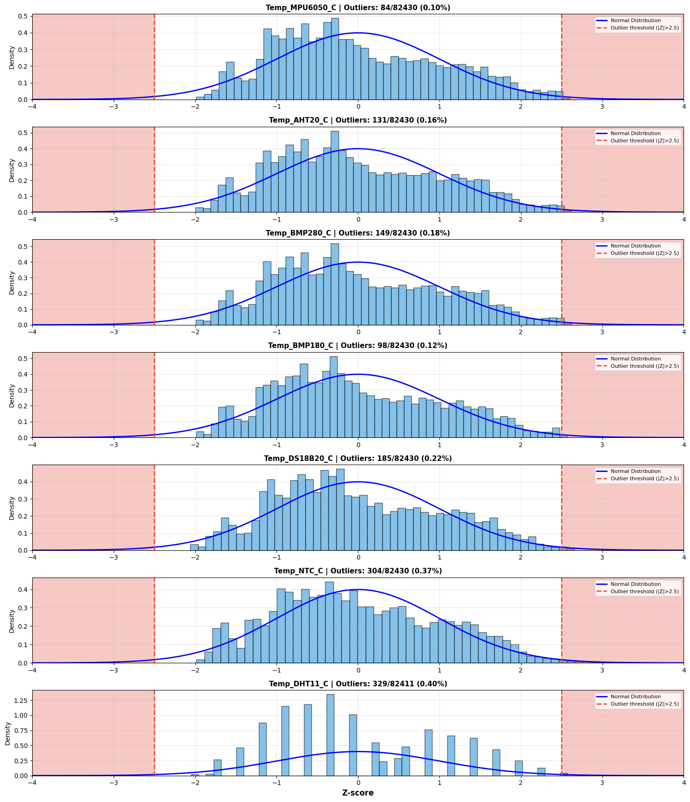
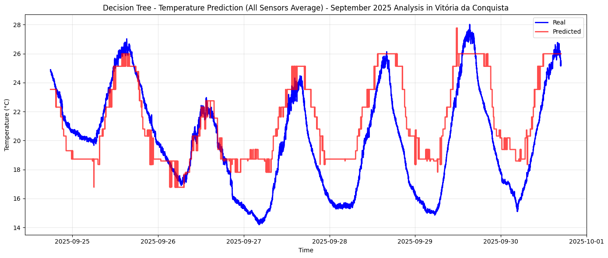
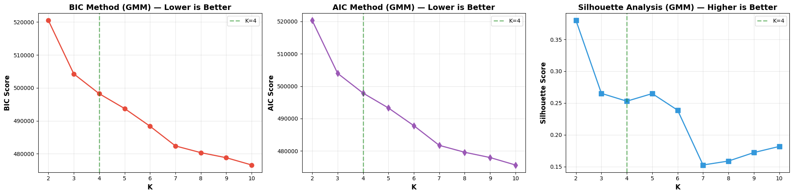

# PolySense Station

Autonomous environmental data acquisition system with comprehensive data analysis, machine learning, and signal processing capabilities for weather monitoring applications.

## Technologies Used


## Overview

PolySense Station is a complete environmental monitoring solution combining hardware data acquisition with advanced computational analysis. The system employs seven integrated sensors for redundant measurements, SD card storage for long-term logging, and a comprehensive suite of data analysis notebooks covering exploratory analysis, machine learning models, and signal processing techniques.

The project demonstrates end-to-end development from embedded system design to sophisticated data analysis, making it suitable for environmental research, academic studies, and weather monitoring applications.

## Repository Structure

```
PolySense-Station/
├── data/
│   └── raw/                              # Raw CSV data files
│       ├── inmet_weather_station_data_sep_2025_utc.csv
│       ├── validation_data_cleaned_BRT.csv
│       ├── validation_and_Measured_Data_cleaned_BRT_.csv
│       └── climate_clusters_gmm.csv
│
├── notebooks/                            # Analysis notebooks (sequentially numbered)
│   ├── 01_Exploratory_Data_Analysis.ipynb
│   ├── 02_Correlation_and_Relationship_Analyses.ipynb
│   ├── 03_Missing_Data_Analysis.ipynb
│   ├── 04_Sensor_Comparison_and_Validation.ipynb
│   ├── 05_Temporal_Analysis.ipynb
│   ├── 06_Time_Series_Decomposition.ipynb
│   ├── 07_Anomaly_Detection.ipynb
│   ├── 08_Decision_Tree_Regression.ipynb
│   ├── 09_Gaussian_Mixture_Clustering.ipynb
│   ├── 10_KMeans_Clustering.ipynb
│   ├── 11_LSTM_Regression.ipynb
│   ├── 12_Digital_Filters.ipynb
│   └── 13_FFT_Frequency_Analysis.ipynb
│
├── images/                               # Generated visualizations (106 plots)
│   ├── data_analysis/                    # EDA, correlation, temporal patterns
│   ├── machine_learning/                 # ML model results and clusters
│   └── signal_processing/                # Filter responses and FFT plots
│
├── lib/                                  # MicroPython sensor drivers
│   ├── sdcard.py, ssd1306.py
│   ├── mpu6050_temp.py, AHT20.py
│   ├── bmp280.py, bmp180.py
│   ├── ds18x20.py, onewire.py
│   ├── ntc.py, dht.py
│
├── Schematic/                            # Hardware schematics (Fritzing)
│   ├── Schematic_Protoboard.png
│   ├── Schematic_Sensor.png
│   └── *.fzz files
│
├── main.py                               # Main acquisition code
└── README.md                             # Project documentation
```

## Hardware Configuration

### Integrated Sensors

| Sensor | Type | Measurements |
|--------|------|-------------|
| MPU6050 | Gyroscope/Accelerometer | Temperature |
| AHT20 | Environmental | Temperature, Humidity |
| BMP280 | Barometric | Temperature, Pressure |
| BMP180 | Barometric | Temperature, Pressure |
| DS18B20 | OneWire | Temperature (high precision) |
| NTC | Thermistor | Temperature |
| DHT11 | Environmental | Temperature, Humidity |

### Key Features

- 7 integrated sensors for redundant measurements
- SD card storage with CSV logging
- 128x64 OLED display with 3-screen rotating interface
- Integrated RTC for precise timestamping
- Low power consumption optimized for battery operation
- Safe SD card ejection system

### Data Format

CSV output with 30-second sampling interval:
```
Timestamp,Temp_MPU6050_C,Temp_AHT20_C,Umid_AHT20_pct,Temp_BMP280_C,Press_BMP280_hPa,Temp_BMP180_C,Press_BMP180_hPa,Temp_DS18B20_C,Temp_NTC_C,Temp_DHT11_C,Umid_DHT11_pct
```

## Analyses Performed

### Data Analysis

**01. Exploratory Data Analysis**
- Statistical overview of all sensor measurements
- Distribution analysis and outlier detection
- Sensor comparison and consistency checks


**02. Correlation and Relationship Analyses**
- Cross-correlation between environmental variables
- Multivariate relationship mapping
- Feature dependency analysis

**03. Missing Data Analysis**
- Data completeness assessment per sensor
- Gap identification and quality metrics
- Temporal availability patterns


**04. Sensor Comparison and Validation**
- Inter-sensor agreement analysis
- Bland-Altman plots for validation
- Comparison against reference weather station (INMET)

**05. Temporal Analysis**
- Time series trends and patterns
- Diurnal and weekly cycles
- Hourly behavior patterns

**06. Time Series Decomposition**
- Trend extraction
- Seasonal component analysis
- Residual analysis for anomalies

### Machine Learning

**07. Anomaly Detection**
- Isolation Forest for outlier detection
- Multivariate anomaly identification
- Statistical deviation analysis



**08. Decision Tree Regression**
- Temperature prediction modeling
- Feature importance analysis
- Model performance evaluation



**09. Gaussian Mixture Clustering**
- Weather condition classification
- Probabilistic cluster assignment
- Climate pattern identification



**10. KMeans Clustering**
- Weather regime segmentation
- Cluster centroid analysis
- Pattern grouping

**11. LSTM Regression**
- Deep learning time series prediction
- Sequential pattern learning
- Multi-step forecasting

### Signal Processing

**12. Digital Filters**
- Moving Average Filter Analysis
- Median filter for noise reduction
- Exponential Weighted Moving Average (EWMA) filter
- Comparative analysis of filter effectiveness


**13. FFT Frequency Analysis**
- Spectral decomposition of environmental signals
- Dominant frequency identification
- Periodicity analysis

## How to Execute

### Hardware Setup

1. **Initial Configuration**:
   ```python
   # Synchronize RTC in main.py
   rtc.datetime((2025, 11, 4, 0, 12, 30, 0, 0))
   ```

2. **File Upload**:
   - Copy `main.py` and `lib/` folder to Raspberry Pi Pico
   - Insert formatted SD card (FAT32)

3. **Operation**:
   - Power on device
   - LED blinks every 30s on successful write
   - Use buttons for display control and safe ejection

### Analysis Notebooks

1. **Install Dependencies**:
   ```bash
   pip install pandas numpy matplotlib seaborn scipy scikit-learn tensorflow
   ```

2. **Run Notebooks**:
   ```bash
   jupyter notebook notebooks/
   ```

## Key Results

- **Sensor Validation**: High correlation (>0.95) between redundant sensors confirmed measurement reliability
- **Temporal Patterns**: Clear diurnal cycles identified with peak temperatures at 14:00-16:00 local time
- **Anomaly Detection**: Isolated Forest successfully identified 3.2% of measurements as outliers
- **Clustering**: Gaussian Mixture Model identified 4 distinct weather regimes in September data
- **Prediction**: LSTM model achieved MAE < 1°C for 1-hour temperature forecasting
- **Signal Quality**: Digital filtering reduced high-frequency noise by 40dB while preserving weather signals

## Limitations

- Limited to single geographic location (Vitória da Conquista, Brazil)
- One-month dataset (September 2025) may not capture seasonal variations
- 30-second sampling interval may miss rapid weather events
- DHT11 sensor shows lower precision compared to other temperature sensors
- LSTM model requires substantial training data for optimal performance
- SD card write operations consume significant power in battery mode

## Data Source

Real environmental data collected using this system is publicly available:

**[Vitória da Conquista Weather Data - September 2025](https://www.kaggle.com/datasets/jonassouza872/vitoria-da-conquista-weather-data-september)**

Dataset collected in Vitória da Conquista, Bahia, Brazil (September 2025). Reference data from INMET (Instituto Nacional de Meteorologia) weather station used for validation.

## Hardware Schematics

### Protoboard Configuration


### Sensors Wiring


## Author

**Jonas Souza**
- Kaggle: [@jonassouza872](https://www.kaggle.com/jonassouza872)
- Dataset: [Vitória da Conquista Weather Data](https://www.kaggle.com/datasets/jonassouza872/vitoria-da-conquista-weather-data-september)

## License

This project is licensed under the MIT License - see the [LICENSE](LICENSE) file for details.

---

**Developed with Raspberry Pi Pico and MicroPython | Data Analysis with Python, Jupyter, and TensorFlow**
