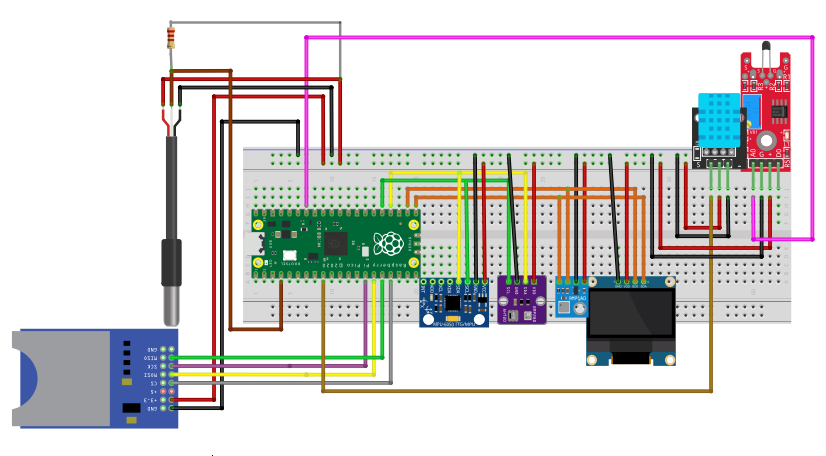

# PolySense Station

Autonomous environmental data acquisition system with multiple sensors, SD card storage, and OLED interface for real-time monitoring.

## Technologies Used

<p align="center">
  
  
  
</p>

## Key Features

- **7 Integrated Sensors**: Simultaneous measurement of temperature, humidity, and pressure
- **SD Card Storage**: CSV logs with timestamp
- **128x64 OLED Display**: 3-screen rotating interface for data visualization
- **Integrated RTC**: Precise date/time recording for each measurement
- **Low Power Consumption**: Optimized for extended battery operation
- **Power Management**: Display control via button for energy saving
- **Safe Ejection**: Safe SD card unmounting system

## Schematics

### Protoboard Schematic


### Sensors Schematic


## Supported Sensors

| Sensor | Type | Measurement |
|--------|------|-------------|
| **MPU6050** | Gyroscope/Accelerometer | Temperature |
| **AHT20** | Environmental | Temperature and Humidity |
| **BMP280** | Barometric | Temperature and Pressure |
| **BMP180** | Barometric | Temperature and Pressure |
| **DS18B20** | OneWire | Temperature (high precision) |
| **NTC** | Thermistor | Temperature |
| **DHT11** | Environmental | Temperature and Humidity |

## Required Hardware

- Raspberry Pi Pico
- OLED Display SSD1306 (128x64) I2C
- SD Card Module SPI
- Sensors listed above
- Buttons (ejection and display control)
- Power supply / Battery

## Pin Configuration

### I2C
- **I2C0**: SDA=16, SCL=17 (BMP180, OLED)
- **I2C1**: SDA=18, SCL=19 (MPU6050, AHT20, BMP280)

### SPI (SD Card)
- **SCK**: GPIO 10
- **MOSI**: GPIO 11
- **MISO**: GPIO 12
- **CS**: GPIO 13

### Other
- **OneWire (DS18B20)**: GPIO 2
- **NTC**: GPIO 28 (ADC)
- **DHT11**: GPIO 9
- **Ejection Button**: GPIO 3
- **Display Button**: GPIO 22

## Data Format

The system generates a CSV file (`datalog_final.csv`) with the following columns:

```csv
Timestamp,Temp_MPU6050_C,Temp_AHT20_C,Umid_AHT20_pct,Temp_BMP280_C,Press_BMP280_hPa,Temp_BMP180_C,Press_BMP180_hPa,Temp_DS18B20_C,Temp_NTC_C,Temp_DHT11_C,Umid_DHT11_pct
```

**Sampling interval**: 30 seconds

## Published Dataset

Real weather data collected using this system is available on Kaggle:

📊 **[Vitória da Conquista Weather Data - September 2025](https://www.kaggle.com/datasets/jonassouza872/vitoria-da-conquista-weather-data-september)**

This dataset contains environmental measurements from September 2025 collected in Vitória da Conquista, Bahia, Brazil, demonstrating the system's real-world application and data quality.

## How to Use

1. **Initial Setup**:
   ```python
   # Synchronize the RTC (uncomment and adjust date/time in main.py)
   rtc.datetime((2025, 11, 4, 0, 12, 30, 0, 0))
   ```

2. **File Upload**:
   - Copy `main.py` and the `lib/` folder to the Raspberry Pi Pico
   - Insert formatted SD card (FAT32)

3. **Operation**:
   - Power on the device
   - LED blinks on each successful write
   - Use display button to turn OLED on/off
   - Press ejection button for safe SD unmounting

4. **LED Indicators**:
   - **Continuous fast blinking**: SD Card error
   - **Short blink every 30s**: Successful write
   - **5 slow blinks**: SD Card safely unmounted

## Project Structure

```
PolySense-Station/
├── main.py              # Main code
├── Testesdcard.py       # SD module tests
├── lib/
│   ├── sdcard.py        # SD Card driver
│   ├── ssd1306.py       # OLED driver
│   ├── mpu6050_temp.py  # MPU6050 driver
│   ├── AHT20.py         # AHT20 driver
│   ├── bmp280.py        # BMP280 driver
│   ├── bmp180.py        # BMP180 driver
│   ├── ds18x20.py       # DS18B20 driver
│   ├── onewire.py       # OneWire protocol
│   ├── ntc.py           # NTC driver
│   └── dht.py           # DHT11 driver
└── Schematic/
    ├── Schematic_Protoboard.png
    ├── Schematic_Sensor.png
    ├── Schematic_protoboard.fzz
    └── Schematic_Sensors.fzz
```

## Development

This project was developed for environmental monitoring applications that require:
- Multiple measurement sources for redundancy and precision
- Long-duration autonomous operation
- Reliable historical data logging
- Low power consumption

---

**Developed with Raspberry Pi Pico and MicroPython**
